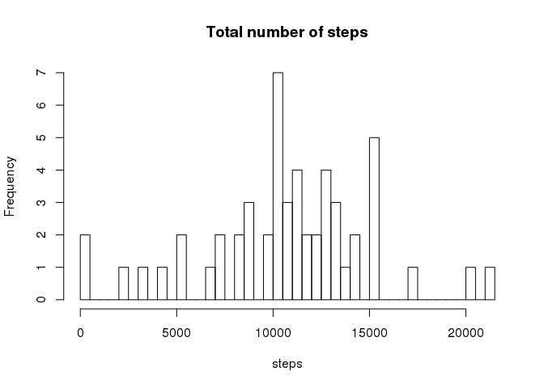
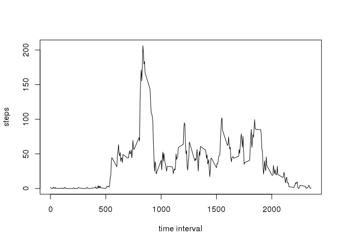
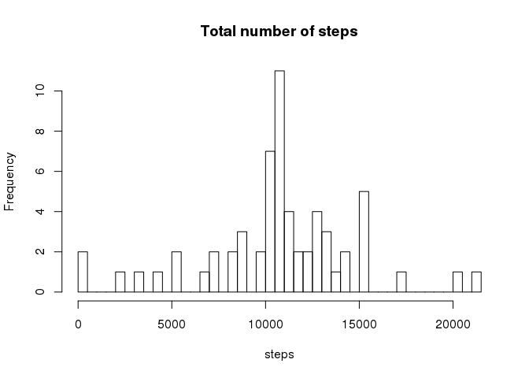
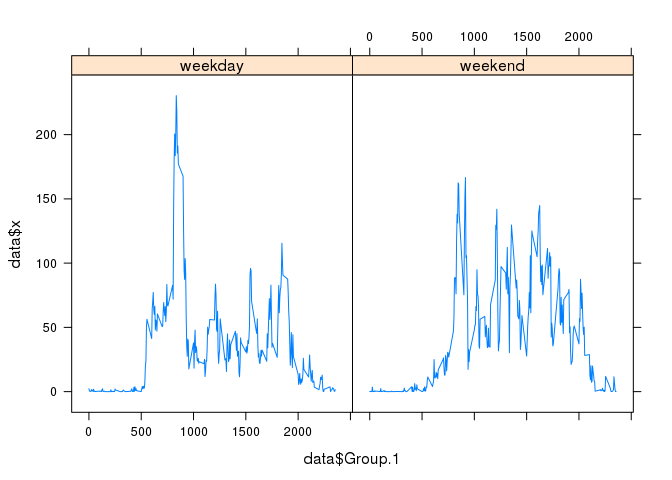

# Reproducible Research: Peer Assessment 1


```r
# set the working directory:
setwd("/home//jahnen/Dropbox/Learning/Data Science Degree/5 - Reproducible Research/week 3 - Distribution and checklist/Assignment 1/RepData_PeerAssessment1/")

# unzip the data:
unzip("activity.zip")

# load data into R:
activity.data <- read.csv("activity.csv")
```

##1. What is mean total number of steps taken per day?


```r
# 1. Calculate the total number of steps taken per day:
steps.total_number.per_day <- aggregate(activity.data$steps, list(activity.data$date), FUN = "sum")

# 2. If you do not understand the difference between a histogram and a barplot, 
# research the difference between them. Make a histogram of the total number 
# of steps taken each day.
hist(steps.total_number.per_day$x, main ="Total number of steps", xlab = "steps", breaks = 50)
```

 

```r
# 3. Calculate and report the mean and median of the total number of steps taken per day
s <- summary(steps.total_number.per_day$x)
s
```

```
##    Min. 1st Qu.  Median    Mean 3rd Qu.    Max.    NA's 
##      41    8841   10760   10770   13290   21190       8
```

The **mean** of the total number of steps taken per day is 10770 and the **median** is 10760.

##2. What is the average daily activity pattern?


```r
# 1. Make a time series plot (i.e. type = "l") of the 5-minute interval (x-axis) 
# and the average number of steps taken, averaged across all days (y-axis)

# calculate the average for each 5-min interval:
steps.interval.average <- aggregate(activity.data$steps, list(activity.data$interval), FUN = "mean", na.rm = TRUE)

# create now the time series plot
plot(steps.interval.average$Group.1, steps.interval.average$x, xlab = "time interval", ylab="steps", type = "l")
```

 

```r
# 2. Which 5-minute interval, on average across all the days in the dataset, 
# contains the maximum number of steps?

steps.interval.max <- steps.interval.average[steps.interval.average$x == max(steps.interval.average$x, rm.na = TRUE), ]
```

The interval with the **maximal number of average steps** is time interval 835.

##3. Imputing missing values


```r
# 1. Calculate and report the total number of missing values in the dataset (i.e. 
# the total number of rows with NAs)
activity.missing_data <- nrow(activity.data[is.na(activity.data$steps), ])

# 2. Devise a strategy for filling in all of the missing values in the dataset. 
# The strategy does not need to be sophisticated. For example, you could use the 
# mean/median for that day, or the mean for that 5-minute interval, etc.

# I will fill the slot with the mean of that 5-minutte interval using a loop 
# activity data:

# 3. Create a new dataset that is equal to the original dataset but with the 
# missing data filled in.
new.data <- activity.data
for(i in 1:nrow(new.data)){
    if(is.na(new.data[i, "steps"])){
            new.data [i, "steps"] <- 
                steps.interval.average[steps.interval.average$Group.1 == 
                                           new.data[i, "interval"], "x"]
        }
}

# 4. Make a histogram of the total number of steps taken each day and Calculate
# and report the mean and median total number of steps taken per day. Do these 
# values differ from the estimates from the first part of the assignment? What 
# is the impact of imputing missing data on the estimates of the total daily 
# number of steps?
new.steps.total_number.per_day <- aggregate(new.data$steps, list(new.data$date), FUN = "sum")
hist(new.steps.total_number.per_day$x, main ="Total number of steps", xlab = "steps", breaks = 50)
```

 

```r
# 3. Calculate and report the mean and median of the total number of steps taken per day
new.s <- summary(new.steps.total_number.per_day$x)
new.s
```

```
##    Min. 1st Qu.  Median    Mean 3rd Qu.    Max. 
##      41    9819   10770   10770   12810   21190
```

The data set contains 2304 values. As we added the mean per interval to the dataset in the case there is a missing value, we expect that this new data is quite similar as that in section 2. This is the case.

##4. Are there differences in activity patterns between weekdays and weekends?


```r
# 1. Create a new factor variable in the dataset with two levels – “weekday” and “weekend” indicating whether a given date is a weekday or weekend day.
library(timeDate)
for(i in 1:nrow(new.data)){
    if(isWeekday(new.data[i, "date"])){
        new.data[i, "day"] <- "weekday"
    } else {
        new.data[i, "day"] <- "weekend"
    }
}

# 2. Make a panel plot containing a time series plot (i.e. type = "l") of the 
# 5-minute interval (x-axis) and the average number of steps taken, averaged 
# across all weekday days or weekend days (y-axis). See the README file in the 
# GitHub repository to see an example of what this plot should look like using
# simulated data.
library(lattice)
# subset weekday:
new.data.weekday <- new.data[new.data$day == "weekday", ]
new.steps.average.weekday <- aggregate(new.data.weekday$steps, list(new.data.weekday$interval), FUN = "mean", na.rm = TRUE)
new.steps.average.weekday$day <- "weekday"

# subset weekend:
new.data.weekend <- new.data[new.data$day == "weekend", ]
new.steps.average.weekend <- aggregate(new.data.weekend$steps, list(new.data.weekend$interval), FUN = "mean", na.rm = TRUE)
new.steps.average.weekend$day <- "weekend"

# merge again:
data = rbind (new.steps.average.weekday, new.steps.average.weekend)

# now make the pplot, Group.1 is interval, x the value and day is the factor:
xyplot(data$x ~ data$Group.1 | data$day, layout=c(2,1), type = "l")
```

 

We can see that the activity starts later on weekends and there is no really high peak during the day.
